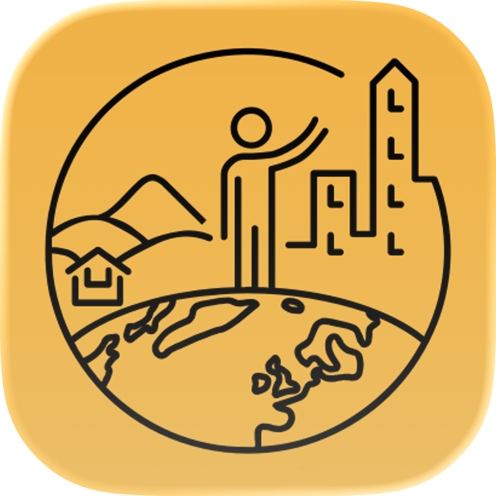

<div align="center">


# APHuG Exam Prep App
</div>

A comprehensive macOS study companion app for AP Human Geography exam preparation. Integrated study planning, timed practice sessions, curated resources, and distraction-free music streaming—all in one place.

## Features

### Study Plans
- **Built-in 14-Day Schedule** — Pre-configured study plan covering all 7 units of AP Human Geography
- **Custom Study Plans** — Create your own study days with personalized tasks and time blocks
- **Progress Tracking** — Visual progress bars and completion tracking across all plans

### Today's Session
Live countdown timer with:
- Task-by-task breakdown with suggested time allocations
- Circular progress ring that counts down and turns red on overtime
- Pause/resume controls with automatic advancement
- Real-time progress tracking across your entire study day

### Practice Exams
- 10 curated AP study resources embedded in the app
- Built-in browser with back/forward/reload controls
- Filter sources by type (MC, FRQ, Free, Official)
- Quick links to Albert.io, College Board, Fiveable, and more

### Cram Mode
Emergency revision tools for exam day:
- **Diagnostic Quiz** — 21 questions (3 per unit) to identify weak spots
- **Flashcard Deck** — Unit-organized flashcards with weak-area prioritization
- **Exam-Day Guide** — FRQ strategies, timing tips, and what to bring

### Study Music
- Pandora integration with preset study stations
- Lo-Fi Hip Hop, Classical, Ambient, Jazz, Cinematic, Nature Sounds, and Game OSTs
- Music continues playing while you study other sections
- Full browser access to browse and customize stations

### Textbook Viewer
- Integrated PDF reader for the AP Human Geography textbook
- Auto-fitting page scaling and single-page display
- Floating page indicator with real-time navigation

### Study Resources
Curated links to:
- AP Classroom and AP Daily Videos
- Unit-specific study guides (Heimler's History, Knowt, Fiveable)
- Pre-built flashcard decks
- Data sources (World Bank, UN, USDA, CIA Factbook)

### Onboarding
- Interactive walkthrough covering all app features
- Tips and keyboard shortcuts for navigating the interface
- Accessible from the help button (?) in the toolbar

## System Requirements
- macOS 14.0+
- Xcode 15.0+
- Swift 5.9+

## Project Structure
```
APHuG Exam Prep App/
├── Core Views
│   ├── ContentView.swift          # Main navigation hub
│   ├── StudyPlanView.swift        # Built-in 14-day plan
│   ├── CustomPlanView.swift       # User-created study days
│   ├── SessionView.swift          # Timer and session controls
│   ├── DayDetailView.swift        # Per-day task details and links
│   ├── SessionDetailView.swift    # Live timer display
│   ├── PracticeView.swift         # Study resource browser
│   ├── CramView.swift             # Emergency last-minute tools
│   ├── MusicView.swift            # Pandora integration
│   ├── TextbookView.swift         # PDF viewer
│   ├── ResourcesView.swift        # Curated study links
│   └── OnboardingView.swift       # Feature walkthrough
│
├── Models
│   ├── StudyDay.swift             # Built-in study day structure
│   ├── StudyTask.swift            # Individual task within a day
│   ├── StudyResource.swift        # External study resource
│   ├── CustomStudyDay.swift       # User-created study days
│   ├── SessionManager.swift       # Timer state management
│   └── PracticeExamSource.swift   # Practice resource metadata
│
├── Components
│   ├── WebViewComponents.swift    # Reusable web browser UI
│   └── WebViewNavigator.swift     # WebView state controller
│
├── Assets
│   ├── AP Human Geography.pdf     # Embedded textbook
│   ├── DetailedStudyPlan.csv      # 14-day curriculum data
│   └── Day-Unitfocus-*.csv        # Study day specifications
│
└── Config
    ├── APHuG_Exam_Prep_AppApp.swift  # App entry point
    └── APHuG_Exam_Prep_App.entitlements  # macOS permissions
```

## Data Persistence
- **Built-in Study Plans** — Loaded from CSV files in the app bundle
- **Custom Study Plans** — Encoded as JSON and persisted in UserDefaults
- **Session State** — In-memory with SessionManager ObservableObject
- **Onboarding Status** — Boolean flag in UserDefaults (shown once per installation)

## Architecture Highlights

### State Management
- `@State` for view-local state (selected days, UI toggles)
- `@StateObject` for shared business logic (SessionManager, WebViewNavigator)
- `@ObservedObject` for cross-view reactive updates
- `@Binding` for parent-child property synchronization

### Performance Optimizations
- **Always-Active Pandora** — Music continues playing when switching tabs (see ContentView detail pane ZStack)
- **Lazy-Loaded Web Views** — Browser panes only initialize when first accessed
- **CSV Streaming** — Study plans loaded once at app launch, then cached

### Network & Web
- WKWebView for embedded browser experiences
- Offline-capable (all practice resources are web-accessible, but not cached locally)
- Navigation delegation (WebViewNavigator) for go-back/forward/reload controls

## Building & Running

### Prerequisites
1. Xcode 15.0+
2. macOS 14.0+ development environment
3. No external dependencies (native SwiftUI + WebKit)

### Build Steps
```bash
cd "/Users/apmckelvey/Desktop/Coding Files/APHuG Exam Prep App"
xcode-build build
```

Or open directly in Xcode:
```bash
open "APHuG Exam Prep App.xcodeproj"
```

Then press `⌘R` to build and run.

## Usage Tips

### Keyboard Shortcuts
- **↩ (Return)** — Advance to next task during Today's Session (on last page of onboarding)
- **⌃⌘F** — Full-screen any web browser pane
- **⌘W** — Close detail pane (standard macOS)

### Mouse & Trackpad
- **Drag divider** — Resize sidebar/browser width
- **Pinch-to-zoom** — Adjust text size in embedded web views
- **Swipe/Right-click** — Open context menu on custom study days (Edit/Delete)

### Study Workflow
1. Pick a day from "Study Plan" or create one in "My Plan"
2. Click its scheduled tasks to see direct study links
3. Hit "Clock In" in Today's Session to start the timer
4. Browse Pandora or practice resources while working
5. Mark tasks done to auto-advance the timer
6. Track progress with the completion bar

## File Descriptions

### Key Files
- **StudyDay.swift** — Represents a single study day (unit, tasks, time, completion)
- **StudyTask.swift** — Individual study activity (content review, MC practice, FRQ)
- **SessionManager.swift** — Observable object managing the live countdown timer state
- **CustomStudyDay.swift** — User-editable study day model (Identifiable + Codable + Hashable)
- **WebViewNavigator.swift** — Observable wrapper for WKWebView navigation and state
- **OnboardingView.swift** — Multi-page onboarding tutorial with feature tips

### Data Files
- **DetailedStudyPlan.csv** — Full 14-day curriculum breakdown
- **AP Human Geography.pdf** — Official AP textbook (embedded in app bundle)

## Development Notes

### Common Tasks

**Add a new study resource:**
1. Update `StudyResource` or add to `PracticeExamSource` enum
2. Create link entry in resource list or practice view
3. Test URL validity in embedded browser

**Modify the 14-day plan:**
1. Edit `DetailedStudyPlan.csv` or source CSV files
2. Update the parsing logic in `StudyDay.loadFromCSV()`
3. Rebuild and test

**Extend Pandora stations:**
1. Add new `StudyStation` entry to `studyStations` array in MusicView
2. Provide icon (SF Symbols) and search URL
3. Test station loads correctly

**Debug the timer:**
1. Set breakpoints in `SessionManager` timer callbacks
2. Use `timeRemainingSeconds` and `taskProgress` computed properties
3. Check `@Published` variables for state mutations

### Known Limitations
- Pandora must be accessed through embedded web view (API unavailable)
- PDF textbook reader doesn't support searching or annotation
- Custom study plans stored locally per device (no cloud sync)
- Practice exam resources require active internet connection

## Contributing
This project is a personal exam prep tool. For significant changes or issue reports, please document the modification thoroughly.

## License
© 2026 APHuG Exam Prep App. Educational use only.

## Contact & Support
For questions or feedback about this app, consult the onboarding guide (?) or review the feature-specific tips embedded in each view.

---

**Last Updated:** April 14, 2026  
**Version:** 1.0  
**Target Exam:** AP Human Geography (May 5 2026)
